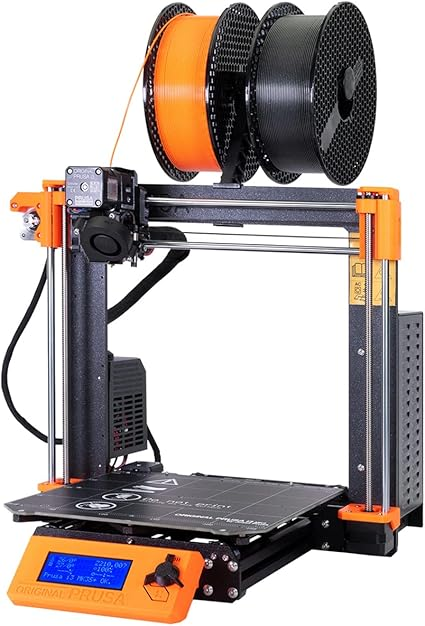
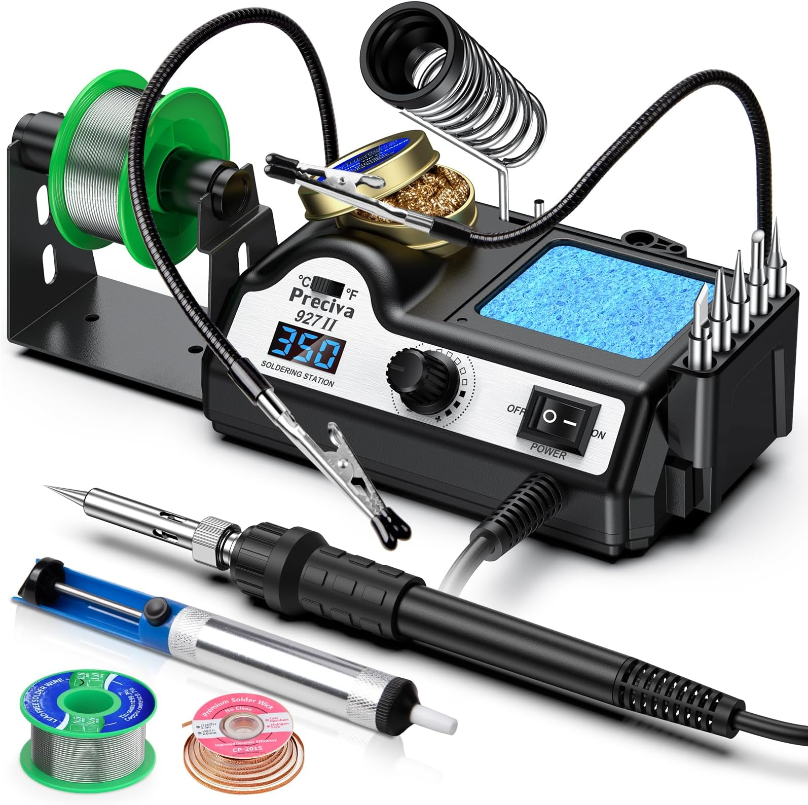
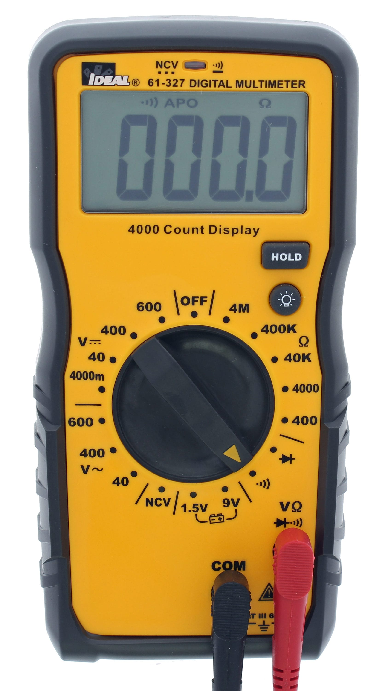
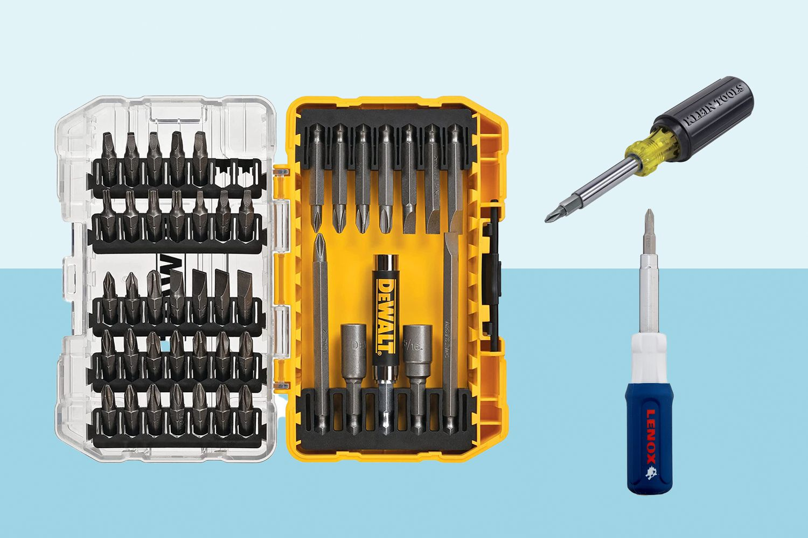

# JetCar
> 21/12/2025 - Car uses nvidia jetpack 5.1 and ros2 humble. This repository is a practical use of machine learning technologies.

<p align="center">
    
</p>

JetCar is an autonomous AI car using NVIDIA Jetson Orion. This car allows you:
- Experience Edge AI - see how ML models are implemented in daily scenarios;
- Have fun - play around with multiple applications and functionalities of the car;

Build JetCar to spend time with your family or friends. It's a great way to expand your knowledge and skill set. 

## Table of contents
- [Assembly](#assembly)
- [Installation](#installation)
- [Examples](#examples)
- [License](#license)


## Assembly
Assembling the JetCar involves certain tools and skills. In the table below you see the tools and skills needed to use them:


| Id | Tool name                     | Description                                                                 | Image / Reference |
|----|-------------------------------|-----------------------------------------------------------------------------|-------------------|
| 1  | Original Prusa i3 MK3S 3D Printer | Fabricate mechanical parts and structural components                        | <p align="center"></p> |
| 2  | Soldering Station              | Solder electrical connections for sensors, power systems, and Jetson Orin    | <p align="center"></p> |
| 3  | Multimeter                     | Measure voltage, continuity, and current for debugging and validation       | <p align="center"></p> |
| 4  | Screwdriver Set                | Assemble mechanical components and mount electronics                         | <p align="center"></p> |
| 5  | Computer                       | Configure OS, install drivers, deploy software, and run tests   | <p align="center"></p> |


The instructions is devided into two parts:
1. <a href="./assets/md/chassis-assembly.md">Chassis assembly</a>: build a solid foundation that supports all mechanical components and ensures stability, durability, and precise control of the car. This stage includes mounting the arduino nano, step-down voltage regulator, and servo.

2. <a href="./assets/md/body-assembly.md">Body</a>: install the body shell onto the chassis and mount all electronic components, including sensors and the NVIDIA Jetson Orin. This step enables perception, computation, and interaction with the environment, allowing the car to execute programmed behaviors.

## Installation
Setting up software involves two major steps. One is uploading the chassis control sketch to arduino and the second is cloning the repository onto the jetson.

### Arduino nano
...

### Jetson orion nano
...

## Examples
In the ```jetcar``` directory there are multiple examples of applications that use magical power of machine learning and computer vision. Checkout them:

### SLAM (Simultaneous localization and mapping)
...

### Object Follower (Convolutional neural network)
...

### Line Follower (Computer vision) 
...

### TSR (Traffic sign recognition)
...

## License
This project is licensed under the MIT License. See the LICENSE file for details.
