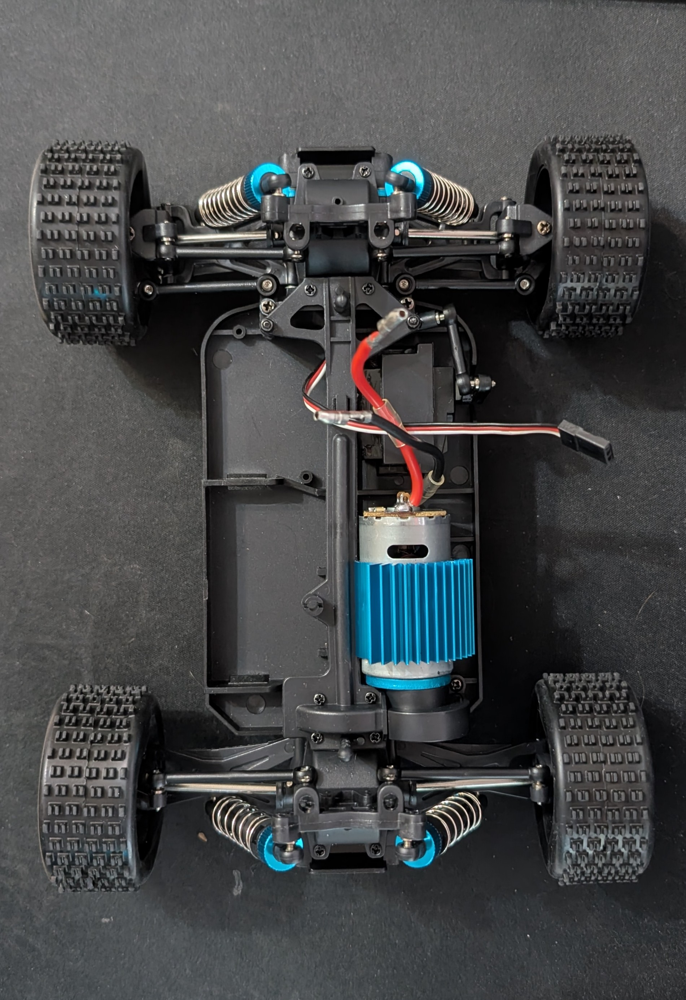
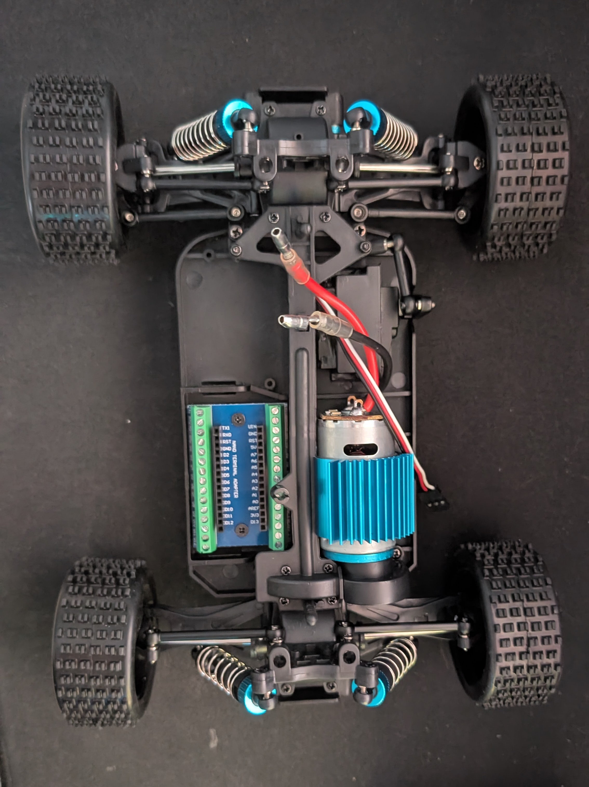
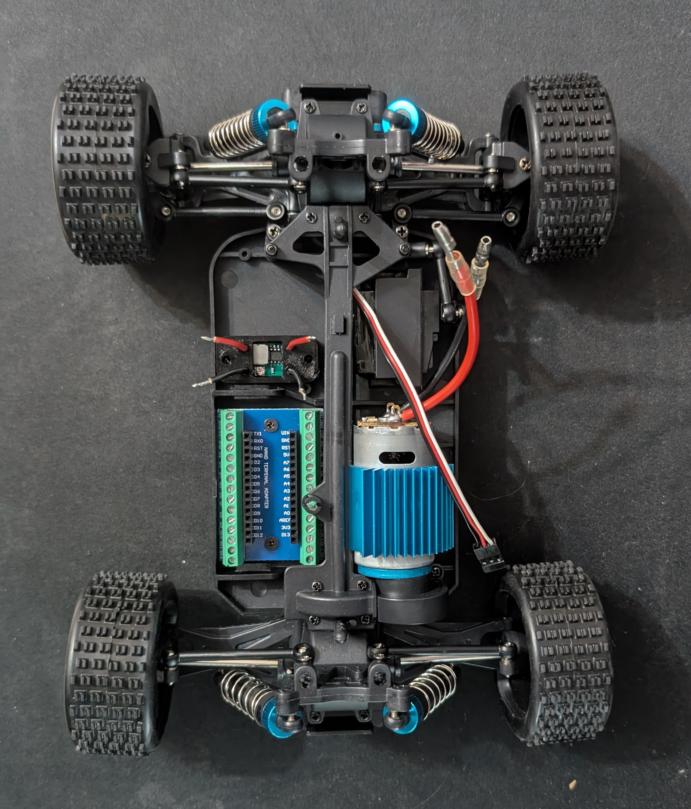

# JetCar - chassis assembly
> Image below shows empty chassis, out of the box.

<p align="center">
    
</p>

## Arduino nano mount
Drill some holes into the chassis and print ```assets/stl/arduino-nano-mount.stl```. Install sleeves with internal thread into the 3d printed element. Next screw everything together. It should look like this:

<p align="center">
    
</p>

## Step-down voltage regulator mount
Drill some holes into the chassis and print ```assets/stl/step-down-voltage-regulator-mount.stl```. Install sleeves with internal thread into the 3d printed element. Solder 4 cables for in+, in-, out+, out-. Next screw everything together. It should look like this:

<p align="center">
    
</p>

## Motor controller mount
Drill some holes into the chassis and print ```assets/stl/motor-controller-mount.stl```. Install sleeves with internal thread into the 3d printed element. Solder 8 cables for VM, VCC, GND, A01, A02, PWMA, AI1, AI2. Next screw everything together. It should look like this:

<p align="center">
    
</p>

## Solder and connect cables
Solder together all the GND pins with the GND output pin of the voltage regulator. Solder together all the 5V pins with the 5V output pin of the voltage regulator. Note that motor cabels should be soldered to the motor controller!

At the end solder special power connector to the input pins of the voltage regulator.

<p align="center">
    
</p>

Now connect servo and motor controller to the arduino nano:
- Servo pwm pin to arduino D3 pin;
- Motor controller PWMA to D5 pin;
- Motor controller AI1 to D6 pin;
- Motor controller AI2 to D7 pin;
